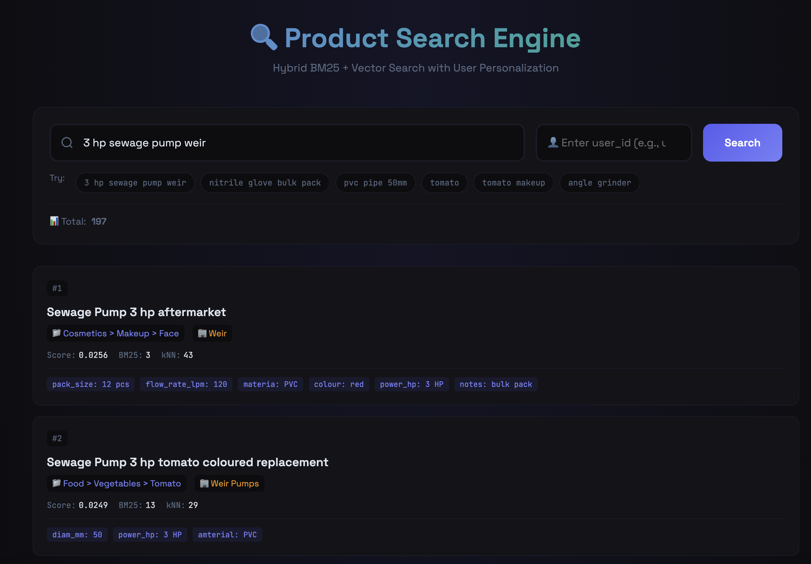
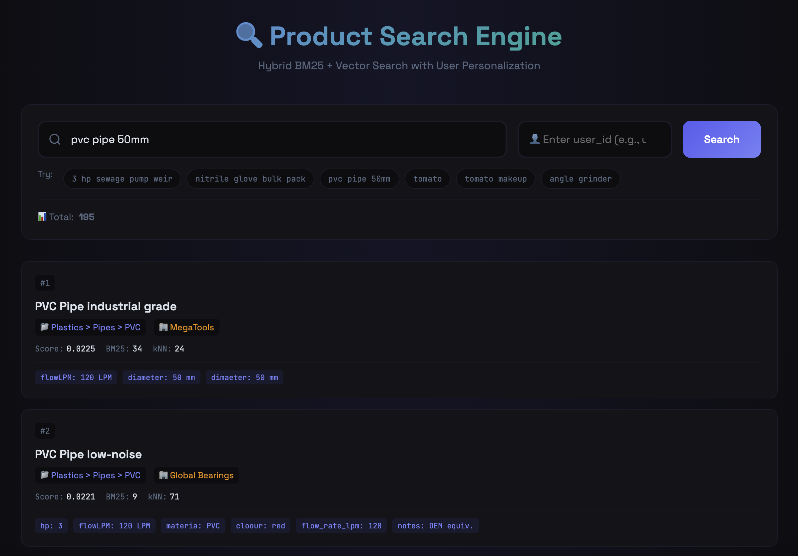
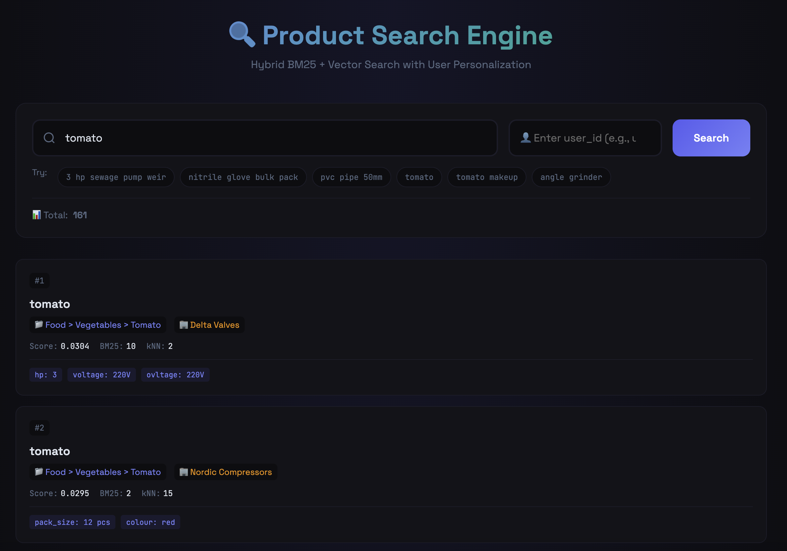
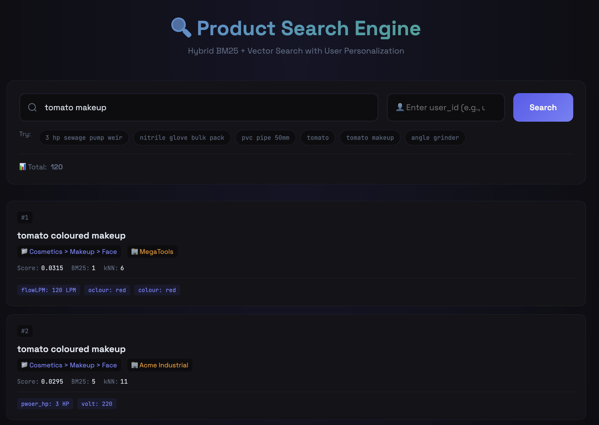
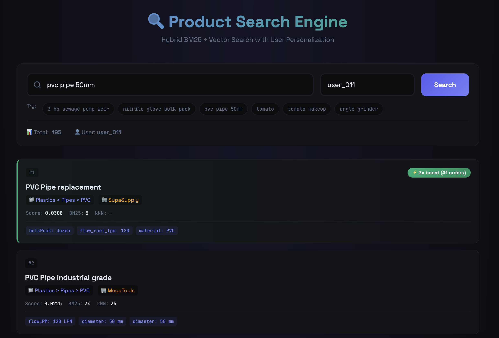

# Product Search Engine

A scalable product search engine built with **FastAPI**, **Elasticsearch**, and **sentence-transformers**. Features hybrid BM25 + vector search with user-level personalization.



---

## Quick Start

```bash
# 1. Install uv (Python package manager)
curl -LsSf https://astral.sh/uv/install.sh | sh

# 2. Install dependencies
cd src && uv sync

# 3. Start everything (Elasticsearch + FastAPI)
./run.sh
```

- **Web UI**: http://localhost:8000
- **API Docs**: http://localhost:8000/docs

---

## Task 1 — Index Design and Mapping

### Analyzers

```json
{
  "product_analyzer": ["standard", "lowercase", "product_synonyms", "english_stop", "english_stemmer"],
  "product_search_analyzer": ["standard", "lowercase", "product_synonyms"]
}
```

### Normalizers

```json
{
   "keyword_normalizer": ["lowercase", "trim"]
}
```

Synonyms loaded from `data/synonyms.json` at index creation (`wrench ↔ spanner`, `pipe ↔ tube`).

### Field Mapping

| Field | Type | Purpose |
|-------|------|---------|
| `title.value` / `description.value` | text (analyzed) | Full-text search |
| `title.raw` / `description.raw` | text (not indexed) | Display only |
| `vendor.value` | keyword + text subfield | Filtering + search |
| `category` | text + keyword | Search + facets |
| `category_level1/2/3` | keyword | Hierarchical filtering |
| `attributes` | object (not indexed) | Raw display in UI |
| `attributes_search` | text | **Searchable condensed attributes** |
| `embedding` | dense_vector (384 dims) | Semantic/vector search |
| `weight_kg/g/lb/oz` | float | Multi-unit range queries |
| `region_availability` | keyword array | Multi-region filtering |

### Key Design: `attributes_search`

Instead of indexing each attribute key individually (which creates mapping explosion with millions of products), I condense all attributes into a single searchable string:

```json
{
  "attributes": {"power_hp": "3 HP", "flow_lpm": 120, "material": "PVC"},
  "attributes_search": "power_hp: 3 HP, flow_lpm: 120, material: PVC"
}
```

**Why?** This is a 10K sample, but the solution is designed to scale to millions of products with arbitrary attributes. A single text field:
- Avoids dynamic mapping bloat
- Works with both BM25 and embeddings
- Handles typos in attribute keys naturally via fuzzy text search

### Handling Messy Data

| Problem | Solution |
|---------|----------|
| Inconsistent attribute keys (`colur`, `diam_mm`) | Normalize to `key: value` in `attributes_search`; raw kept for display |
| Non-normalized units (`kg`, `KG`, `kilogram`) | Map to canonical + convert to all weight units |
| Junk text (`### $$ @@`, duplicate words) | Regex cleaning; `.raw` preserves original |
| Messy categories (`Safety>>Gloves`) | Parse to `level1/2/3`; normalize separators |

**Full mapping**: [`infra/elasticsearch/mappings/products.json`](infra/elasticsearch/mappings/products.json)

---

## Task 2 — Core Search Functionality

### API

```
GET /search?q={query}&size=20&start=0&user_id=user_011
```

### Hybrid Search Architecture

```
┌────────────────────────────────────────────────────────┐
│                   QUERY: "pvc pipe 50mm"               │
├────────────────────────────────────────────────────────┤
│  1. BM25 (Keyword)                                     │
│     └─ multi_match on title^5, category^3, vendor^4,  │
│        description, attributes_search^2               │
│                                                        │
│  2. kNN (Semantic)                                     │
│     └─ 384-dim embedding on title+desc+attributes     │
│                                                        │
│  3. Manual RRF Fusion                                  │
│     └─ score = 1/(60+rank_bm25) + 1/(60+rank_knn)     │
│                                                        │
│  4. User Boost (if user_id provided)                   │
│     └─ Multiply score by purchase history factor      │
└────────────────────────────────────────────────────────┘
```

### Example Queries

| Query | Expected | Result |
|-------|----------|--------|
| `3 hp sewage pump weir` | Weir pumps with 3HP | ✅ Weir vendor + `power_hp: 3 HP` at top |
| `nitrile glove bulk pack` | Bulk nitrile gloves | ✅ Gloves with bulk attributes ranked first |
| `pvc pipe 50mm` | 50mm PVC pipes | ✅ Products with `diameter: 50 mm` boosted |
| `tomato` | Food items | ✅ `Food > Vegetables > Tomato` category |
| `tomato makeup` | Cosmetics (not food) | ✅ `Cosmetics > Makeup > Face` category |

### Screenshots

**Query: "3 hp sewage pump weir"** — Weir vendor pumps with 3HP ranked first:


**Query: "pvc pipe 50mm"** — 50mm diameter pipes boosted via attributes_search:


**Query: "tomato"** — Food items first:


**Query: "tomato makeup"** — Cosmetics first (not food):


---

## Task 3 — Handling Poor Data Quality

### Strategies

| Strategy | Implementation | Effect |
|----------|----------------|--------|
| **Synonym analyzer** | `data/synonyms.json` injected at index time | `wrench` finds `spanner` |
| **Text cleaning** | Regex removes `### $$ @@`, dedup words | Clean searchable text |
| **Unit normalization** | Map `kg/KG/kilogram` → `kg`; store all units | Filter in any unit |
| **Attributes condensed** | `attributes_search` text field | Search any attribute |
| **Vector search** | `all-MiniLM-L6-v2` on title+desc+attributes | Semantic understanding |
| **Numeric boosting** | Extract `50mm`, `3 hp` from query, boost matches | Precise attribute matching |
| **Vendor detection** | Fuzzy match vendor names in query | `weir` boosts Weir products |

### Test Framework

I implemented a test framework ([`src/tests/test_search_queries.py`](src/tests/test_search_queries.py)) to validate search quality:

```python
CHALLENGE_TESTS = [
    SearchTest(
        query="3 hp sewage pump weir",
        expected_vendor_contains="weir",
        expected_attributes=["power_hp", "flow_lpm"],
    ),
    SearchTest(
        query="tomato makeup",
        expected_category_contains="cosmetic",
    ),
    # ... more tests
]
```

Run tests:
```bash
cd src && uv run python tests/test_search_queries.py
```

### Boosting Decisions

Based on test results, I tuned field weights in `_build_bm25_query`:

```python
"fields": [
    "title.value^5",      # Primary identifier
    "category^3",         # Category context
    "vendor.value.text^4", # Brand matters
    "description.value",   # Secondary content
    "attributes_search^2"  # Attribute matching
]
```

Numeric patterns (`50mm`, `3 hp`) get additional phrase boost (40x) on `attributes_search` to surface exact matches.

---

## Task 4 — User-Level Customization

### Architecture

User order history can be stored anywhere (database, API, etc.). For this demo, orders are indexed in Elasticsearch for convenience.

```
┌─────────────────────────────────────────────────────────┐
│  User orders could live in:                             │
│  • PostgreSQL / MySQL                                   │
│  • Redis (for fast lookups)                             │
│  • External API                                         │
│  • Elasticsearch (this demo) ← just for convenience    │
└─────────────────────────────────────────────────────────┘
```

### Boosting Logic

When `user_id` is provided, I fetch their purchase history and apply multipliers:

| Orders | Boost | Rationale |
|--------|-------|-----------|
| 1-5 | 1.2x | Slight preference |
| 6-20 | 1.5x | Regular buyer |
| 21-50 | 2.0x | Heavy user |
| 50+ | 2.5x | Power user |

```python
final_score = base_rrf_score × user_boost_multiplier
```

### Example: User Personalization

**Without user_id** — Standard ranking:


**With user_id=user_011** — Previously ordered "PVC Pipe replacement" (41 orders) jumps to #1 with 2x boost:


---

## Task 5 — Design Decisions & Trade-offs

### Key Trade-offs

| Decision | Trade-off | Rationale |
|----------|-----------|-----------|
| `attributes_search` text field | Less precise filtering | Scales to millions without mapping explosion |
| Manual RRF | More code | Avoids Elasticsearch license constraints |
| Lightweight embeddings (MiniLM) | Less semantic power | Fast indexing, good enough for product search |
| Orders in ES | Not production-ready | Demo convenience; real system uses proper DB |

### Maintenance

| Task | How |
|------|-----|
| **Synonyms** | Edit `data/synonyms.json`, re-index |
| **Categories** | Update `data/categories.json`, re-normalize |
| **Relevance tuning** | Adjust boosts in `_build_bm25_query`, run test framework |
| **A/B testing** | Compare `/search` with different params, log metrics |

### Monitoring

- Track null/empty fields during normalization (logs)
- Monitor index size (attributes not indexed = smaller index)
- Periodic synonym/category refresh from domain experts

---

## Project Structure

```
├── data/                    # Products, orders, synonyms
├── docs/                    # Screenshots
├── infra/elasticsearch/     # Docker + mappings
├── src/
│   ├── services/
│   │   ├── elasticsearch.py # Search logic, RRF, user boost
│   │   ├── embeddings.py    # sentence-transformers
│   │   └── normalizer.py    # Data cleaning
│   ├── tests/               # Search quality tests
│   ├── static/index.html    # Web UI
│   └── main.py              # FastAPI app
└── run.sh                   # One-command startup
```

---

## Deliverables

- ✅ **Index mappings**: [`infra/elasticsearch/mappings/products.json`](infra/elasticsearch/mappings/products.json)
- ✅ **Query/API code**: [`src/services/elasticsearch.py`](src/services/elasticsearch.py)
- ✅ **Preprocessing**: [`src/services/normalizer.py`](src/services/normalizer.py)
- ✅ **Demo UI**: http://localhost:8000 (see screenshots above)
- ✅ **Written report**: This README
